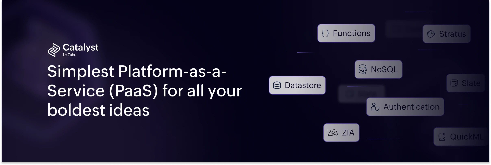

<!-- HEADER -->

<p align="center">
    <a href="https://catalyst.zoho.com">
        
    </a>
    <br />
</p>

```sh
console.log('Hello, World! Welcome to Catalyst by Zoho!');
```

**[Catalyst by Zoho](https://catalyst.zoho.com/?utm_source=github&utm_medium=readme&utm_campaign=catalyst-oss&utm_content=homepage-link)** is a comprehensive cloud development platform that provides both frontend and backend components, including authentication, databases, storage, and computing functions. Built on the same trusted infrastructure that powers Zoho’s enterprise products, Catalyst ensures high security, scalability, and reliability. With seamless integration capabilities and robust development tools, it enables developers to build, deploy, and manage applications efficiently.

#### 🏗️ Roadmap

- 🚧 Have a feature request? [Submit an issue](https://github.com/catalystbyzoho/roadmap/issues) in our **Roadmap Repository**.
- 📅 Track upcoming enhancements in our [Roadmap Project](https://github.com/orgs/catalystbyzoho/projects/1).

#### 📡 Dev Community & Support

- 🗨️ Connect with contributors on [Catalyst Community](https://forums.catalyst.zoho.com/portal/en/community/recent?utm_source=github&utm_medium=readme&utm_campaign=catalyst-oss&utm_content=community-link).
- 🛠️ Need debugging help? Open an issue or reach us at [support@zohocatalyst.com
  ]()

---

⭐ Found our work useful? Smash that 🌟 button and show some love!
